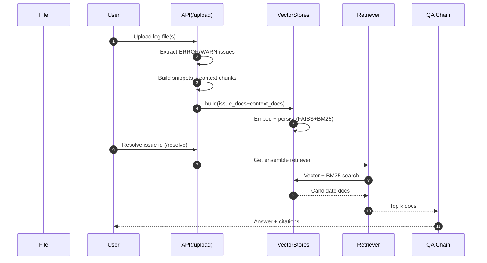

# One Log Journey (Current Simplified Flow)

How a single ERROR line turns into an answer with cited context in the new FastAPI + LangChain implementation.

## 1. High-Level Steps (Now)
1. Read raw file lines
2. Detect ERROR / WARN lines (issue extraction)
3. Build snippet (issue ± surrounding lines)
4. Split broader context chunks (fixed size window)
5. Embed (HF or OpenAI) and index in FAISS
6. Build BM25 lexical index (same docs)
7. User selects issue (or asks a question)
8. Ensemble retrieval (vector + BM25)
9. LLM answer (RetrievalQA stuff) with sources

(Former stages removed: run/session normalization, taxonomy tagging, summarization, cross-encoder rerank.)

## 2. Sequence (Updated)


## 3. Data Transform Snapshot (Now)
| Phase | Input | Output |
|-------|-------|--------|
| Extraction | Raw lines | Issue docs (severity, line_no) |
| Snippet    | Issue doc + neighbors | Short snippet text |
| Chunking   | Raw lines | Context chunk docs (page_content, metadata) |
| Indexing   | Docs | FAISS vectors + BM25 docs |
| Retrieval  | Query text | Top-k documents |
| Answer     | Query + docs | Answer text + source metadata |

## 4. Example Citation Format
```
[foo.log:57] ERROR Unable to locate child bot (BOA_Login)
```

## 5. Answer Skeleton (Current)
```json
{
  "text": "Login failed because required child bot BOA_Login was not found...",
  "citations": [
    {"source": "foo.log", "line_no": 57},
    {"source": "foo.log", "line_no": 55}
  ]
}
```

## 6. Removed / Deprecated Components
| Legacy Component | Status | Replacement |
|------------------|--------|-------------|
| Taxonomy tagging | Removed | Not needed for baseline diagnosis |
| Session/run grouping | Removed | Direct line-based extraction |
| Summarizer | Removed | Simpler raw context chunks |
| Cross-encoder reranker | Removed | Simpler ensemble ranking only |
| Custom context builder | Replaced | LangChain RetrievalQA stuff chain |

## 7. Readiness & Async Build
- If `ASYNC_BUILD=1`, FAISS/BM25 + QA chain build occurs in background; UI polls `/stats`.
- Flags: `index_building`, `qa_ready`.

## 8. Key Simplicity Principles
| Principle | Implementation |
|-----------|----------------|
| Min moving parts | One chain (RetrievalQA) |
| Fast feedback | Async build + toast notifications |
| Persistence optional | Controlled by DISABLE_PERSIST env var |
| Clear citations | Direct metadata (source, line_no) |

## 9. Future Enhancements (Optional)
| Idea | Rationale |
|------|-----------|
| Lightweight rerank | Improve precision for long logs |
| Metadata filters | Severity-only retrieval options |
| Incremental indexing | Skip unchanged files via hash |
| Streaming answers | Show token stream in UI |

## 10. Summary
A raw ERROR line is extracted, surrounded by minimal context, indexed once, and directly fuels a RetrievalQA answer without intermediate taxonomy or rerank complexity.
