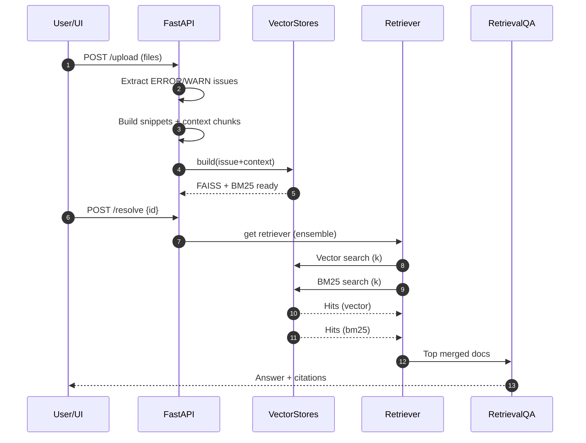

# Implementation Flow (Current System)

Pipeline from file upload to answer in the simplified FastAPI + LangChain stack.

## Stages
1. Upload & Extraction
2. Chunk & Index Build
3. Retrieval (Ensemble)
4. Answer Generation

## Sequence Diagram (Updated)

## Component Responsibilities
| Component | Role |
|-----------|------|
| api.upload | Orchestrates extraction & build (sync or async) |
| extract_issue_docs | Filter ERROR/WARN lines |
| split_context | Chunk raw lines for broader context |
| VectorStores.build | Embed + construct FAISS & BM25 |
| Retriever (ensemble) | Merge lexical + vector results |
| RetrievalQA chain | Single prompt & answer generation |

## Simplification Highlights
| Legacy Element | Status |
|----------------|--------|
| Re-ranker (cross-encoder) | Removed |
| Taxonomy tagging | Removed |
| Session/run detection | Removed |
| Custom context builder | Replaced by chain internal logic |
| Summarization layer | Deferred |

## Async Behavior
If `ASYNC_BUILD=1`:
- /upload returns early with `index_building=true`
- Background task performs VectorStores.build + chain rebuild
- UI should poll `/stats` until `qa_ready=true`

## Error Paths
| Condition | Handling |
|-----------|----------|
| No issues found | Returns empty list; no chain build |
| Resolve before build | 503 error (QA not ready) |
| Embedding failure | Logged; build aborted |
| Load failure (persist) | Warning; fresh build next upload |

## Key Data Objects
| Name | Fields |
|------|--------|
| Issue doc | page_content=line text; metadata:{source,line_no,severity} |
| Context doc | page_content=chunk text; metadata:{source,line_no} |
| Citation | {source,line_no} |

## Performance Tips
| Concern | Mitigation |
|---------|-----------|
| Slow first build | Enable ASYNC_BUILD, reduce CHUNK_SIZE |
| Large memory | Limit retained context docs |
| High latency answers | Lower TOP_K |

## Extension Points
| Goal | Hook |
|------|------|
| Add reranker | After retrieval before QA.invoke |
| Filter by severity | Modify retriever merge logic |
| Streaming output | Replace RetrievalQA with streaming call |
| Incremental add | Implement add() with selective embedding |

Lean implementation keeps iteration speed high while preserving core diagnostic capability.