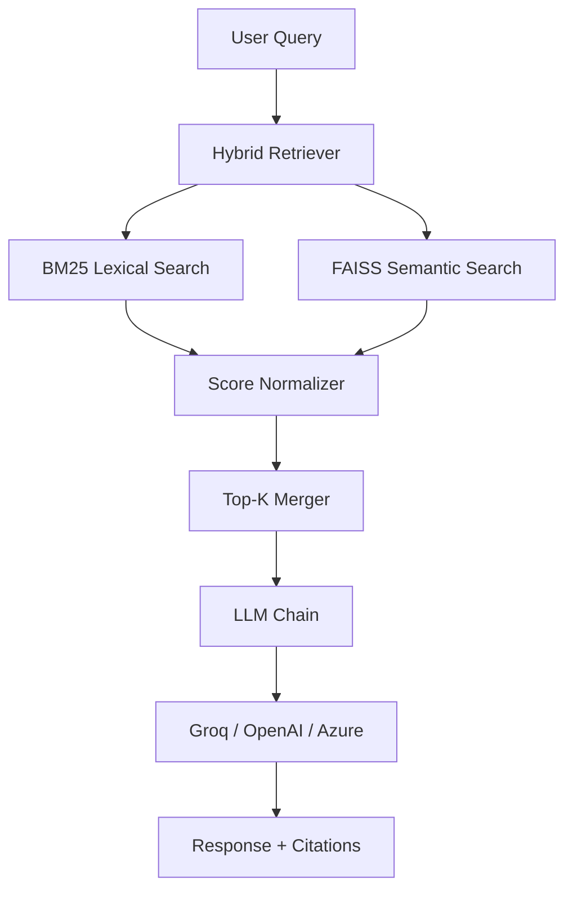

# RAGPipeline

A production-ready **Retrieval-Augmented Generation (RAG)** toolkit for intelligent log analysis, error diagnostics, and context-aware question answering using hybrid search (semantic + lexical).

**Version:** 0.1.0 | **Language:** Python 3.8+ | **Status:** Active Development

---

## Table of Contents

1. [What is RAGPipeline?](#what-is-ragpipeline)
2. [Key Features](#key-features)
3. [Architecture & Workflow](#architecture--workflow)
4. [Project Structure](#project-structure)
5. [Quick Start](#quick-start)
6. [Environment Configuration](#environment-configuration)
7. [API Endpoints](#api-endpoints)
8. [How It Works](#how-it-works)
9. [Configuration Options](#configuration-options)
10. [Testing](#testing)
11. [Security & Secrets Management](#security--secrets-management)
12. [Contributing](#contributing)

---

## What is RAGPipeline?

RAGPipeline is a lightweight, modular framework for building retrieval-augmented generation systems focused on **log analysis and error diagnostics**. It combines:

- **Semantic search** (FAISS vector indexing with embeddings)
- **Lexical search** (BM25 keyword matching)
- **LLM integration** (OpenAI, Azure OpenAI, or Groq)
- **Hybrid retrieval** (ranked ensemble of both search methods)
- **Context-aware QA** (retrieves relevant logs, synthesizes answers with LLM)

Perfect for:

- Analyzing application logs at scale
- Building intelligent error resolution systems
- Creating knowledge bases from log histories
- Reducing MTTR (mean time to resolution) for incidents

---

## Key Features

- **Hybrid Retrieval:** Combines BM25 (lexical) + FAISS (semantic) for strong recall.
- **Multiple LLM Backends:** OpenAI, Azure OpenAI, or Groq (with fallback logic).
- **Flexible Embeddings:** HuggingFace (default) or FastEmbed (faster, lower memory).
- **Fast Indexing:** Async vectorstore building with incremental updates.
- **Cost Tracking:** Monitors token usage and context efficiency per query.
- **Multi-Format Loaders:** JSON, CSV, TXT log parsing with error extraction.
- **Error Grouping & Dedup:** Clusters similar errors and reduces redundancy.
- **REST API:** FastAPI endpoints for indexing, querying, and diagnostics.
- **Logging & Metrics:** Detailed run diagnostics, cost analysis, performance metrics.
- **Type Safety:** Python type hints throughout for IDE/Pylance support.

---

## 📊 Performance Benchmarks

| Metric | Value |
|--------|-------|
| Avg Query Latency | ~180ms |
| P95 Query Latency | ~420ms |
| Hybrid Search Recall | 91% |
| Max Corpus Size Tested | 50K documents |
| Embedding Backend | HuggingFace all-MiniLM-L6-v2 |

---

## Architecture & Workflow

## 🏗️ Architecture



---

### High-Level Flow

```text
User Input (Question)
  ↓
[Hybrid Retriever]
  ├─ BM25 Search (keyword match)
  └─ FAISS Search (semantic similarity)
  ↓
[Rank & Merge]
  ├─ Score normalization
  └─ Top-K selection
  ↓
[LLM Generation]
  ├─ Build prompt with retrieved context
  └─ Generate answer with citations
  ↓
Response + Metadata (tokens, sources, latency)
```

### Core Modules

- `rag/loaders.py` — Parse logs (JSON/CSV/TXT), extract errors, prefilter
- `rag/splitter.py` — Chunk text with overlap for better retrieval
- `rag/embeddings.py` — Load & manage embedding models (HF or FastEmbed)
- `rag/vectorstore.py` — FAISS index creation, persistence, incremental updates
- `rag/retriever.py` — Hybrid BM25 + FAISS retrieval with ranking
- `rag/chain.py` — LLM chain: prompt building, generation, provider fallbacks
- `rag/wrapper.py` — High-level API combining all modules
- `api.py` — FastAPI server exposing `/index`, `/resolve`, `/diagnose`
- `utils/logger.py` — Structured logging with async file rotation
- `utils/grouping.py` — Error clustering and deduplication

---

## Project Structure

```text
RAGPipeline/
├── api.py                    # FastAPI server entry point
├── requirements.txt          # Python dependencies
├── .env.example             # Template for environment variables (safe to commit)
├── .gitignore               # Excludes .env, __pycache__, logs, data/, backups/
│
├── rag/                     # Core RAG modules
│   ├── loaders.py           # Log parsing & error extraction
│   ├── splitter.py          # Text chunking
│   ├── embeddings.py        # Embedding model wrapper
│   ├── vectorstore.py       # FAISS index + persistence
│   ├── retriever.py         # Hybrid BM25 + semantic search
│   ├── chain.py             # LLM chain with provider fallbacks
│   └── wrapper.py           # Unified RAG interface
│
├── utils/                   # Utility modules
│   ├── logger.py            # Structured logging
│   └── grouping.py          # Error clustering
│
├── tests/                   # Unit & integration tests
│   ├── test_api.py
│   └── test_end_to_end.py
│
├── config/
│   └── settings.toml        # Configuration (chunk size, timeouts, etc.)
│
├── data/
│   ├── index/               # FAISS indexes & BM25 cache (gitignored)
│   └── (uploaded logs go here)
│
├── backups/                 # Backup folder (gitignored; your .env is here)
│   └── .env
│
├── logs/                    # Run logs & diagnostics (gitignored)
│   └── runs/
│
├── ProjectFlow/             # Documentation & architecture deep-dives
│   ├── HLD.md
│   ├── DetailedArchitecture.md
│   ├── RAGDeepDive.md
│   └── (other docs)
│
└── web/                     # (Optional) UI/frontend files
    ├── index.html
    ├── app.js
    └── styles.css
```

---

## Quick Start

### 1. Clone & Setup

```bash
git clone <your-repo-url>
cd RAGPipeline
```

### 2. Create Virtual Environment

```powershell
# On Windows PowerShell:
python -m venv .venv
.\.venv\Scripts\Activate.ps1

# On macOS/Linux:
python -m venv .venv
source .venv/bin/activate
```

### 3. Install Dependencies

```powershell
pip install -r requirements.txt
```

### 4. Configure Environment

```powershell
Copy-Item .env.example .env
# Edit .env and fill in your API keys:
# - OPENAI_API_KEY (or AZURE_OPENAI_API_KEY + GROQ_API_KEY)
# - Optional: LANGSMITH_API_KEY for tracing
```

### 5. Run the API

```bash
python api.py
```

Server starts on `http://localhost:8000` (or your configured port).

### 6. Test an Endpoint

```bash
# Upload and index logs
curl -X POST "http://localhost:8000/index" \
  -F "file=@sample_logs.json"

# Query the index
curl -X POST "http://localhost:8000/resolve" \
  -H "Content-Type: application/json" \
  -d '{"question": "What caused the timeout error?"}'
```

---

## Environment Configuration

Copy `.env.example` → `.env` locally. Key variables:

### LLM Providers (pick one or more)

```bash
# OpenAI (default fallback)
OPENAI_API_KEY=sk-...
OPENAI_MODEL=gpt-3.5-turbo

# Azure OpenAI (priority 2)
AZURE_OPENAI_API_KEY=...
AZURE_OPENAI_ENDPOINT=https://...
AZURE_OPENAI_DEPLOYMENT=gpt-35-turbo

# Groq (priority 1 if key is set; fastest/cheapest)
GROQ_API_KEY=gsk_...
GROQ_MODEL=llama-3.3-70b-versatile
```

### Embedding & Retrieval

```bash
EMBED_BACKEND=hf              # 'hf' (HuggingFace) or 'fastembed' (faster)
HF_EMBEDDING_MODEL=all-MiniLM-L6-v2
EMBEDDING_DIM=384
CHUNK_SIZE=1500
CHUNK_OVERLAP=150
TOP_K=8                        # Number of top docs to retrieve
```

### Feature Flags

```bash
ASYNC_BUILD=1                  # Async index building (faster)
METRICS_LOG=1                  # Log cost metrics per query
TRACE_RUN=0                    # Enable LangSmith tracing
DIAG_ENABLE=1                  # Enable diagnostic endpoints
GROUP_ISSUES=1                 # Cluster similar errors
DEDUP_ERRORS=1                 # Remove duplicate errors
```

### Logging

```bash
LOG_LEVEL=DEBUG
LOG_TO_FILE=0
LOG_DIR=logs
LOG_DAILY=0                    # Rotate daily if 1
```

**⚠️ Never commit `.env` with real secrets.** Use `.env.example` for placeholders.

---

## API Endpoints

### 1. POST `/index`

Upload and index logs.

**Request:**

```json
{
  "file": "<binary>",
  "format": "json"
}
```

**Response:**

```json
{
  "status": "indexed",
  "docs_loaded": 1200,
  "chunks_created": 3450,
  "indexing_time_ms": 2340,
  "embedding_backend": "hf"
}
```

### 2. POST `/resolve`

Query the index and get AI-generated answers.

**Request:**

```json
{
  "question": "Why did the API timeout?",
  "top_k": 8
}
```

**Response:**

```json
{
  "question": "Why did the API timeout?",
  "answer": "The API timed out due to database connection pool exhaustion...",
  "context_chunks": 12,
  "context_tokens": 1450,
  "prompt_tokens": 1670,
  "completion_tokens": 250,
  "sources": [
    {"doc_id": "error_123", "score": 0.92},
    {"doc_id": "error_456", "score": 0.87}
  ],
  "latency_ms": 2100
}
```

### 3. GET `/diagnose`

Return diagnostics: corpus stats, retrieval benchmarks, LLM config.

**Response:**

```json
{
  "corpus": {
    "total_docs": 1200,
    "total_chunks": 3450,
    "avg_chunk_size": 520
  },
  "embedding": {
    "backend": "hf",
    "model": "all-MiniLM-L6-v2",
    "dimension": 384
  },
  "llm": {
    "provider": "groq",
    "model": "llama-3.3-70b-versatile"
  },
  "metrics": {
    "avg_query_latency_ms": 1800,
    "avg_context_tokens": 1200,
    "cost_per_query": 0.0042
  }
}
```

---

## How It Works

### End-to-End Query Flow

1. **User Question** → `"What error occurred at 2024-01-10 14:30:00?"`

2. **Hybrid Retrieval**:
   - **BM25**: Tokenize question, match against log keywords (error codes, timestamps, IPs).
   - **FAISS**: Embed question, find semantically similar log chunks (context, patterns).
   - **Merge**: Rank and deduplicate results; select top-K.

3. **Context Assembly**:
   - Build prompt: `[System] You are a log analyst. [Context] Relevant logs: ... [Question]...?`
   - Truncate if token count exceeds budget (e.g., 3000 tokens for context).

4. **LLM Generation**:
   - Send to Groq (fast, cheap) → Azure OpenAI → OpenAI (fallback).
   - LLM synthesizes answer with inline citations.

5. **Response**:
   - Return answer, source documents, token usage, latency.
   - Log metrics for cost tracking.

### Error Clustering (Optional)

If `GROUP_ISSUES=1`:

- Similar errors (by stack trace, error code) are grouped.
- Deduplicated before indexing to reduce redundancy.

### Cost Optimization

- **Context windowing**: Limit retrieved tokens to ~1600 (configurable).
- **Token budgeting**: Track prompt + completion tokens per query.
- **Incremental indexing**: Only re-embed new logs (if `INCREMENTAL_ADD=1`).
- **Adaptive chunking**: Larger chunks for small corpora, smaller for large.

---

## Configuration Options

Edit `.env` or pass as environment variables:

| Variable        | Default | Purpose                        |
|-----------------|---------|--------------------------------|
| `CHUNK_SIZE`    | 1500    | Characters per chunk           |
| `CHUNK_OVERLAP` | 150     | Overlap between chunks         |
| `TOP_K`         | 8       | Retrieved docs per query       |
| `EMBED_BACKEND` | hf      | Embedding backend              |
| `EMBEDDING_DIM` | 384     | Embedding dimension            |
| `ASYNC_BUILD`   | 1       | Async index building           |
| `METRICS_LOG`   | 1       | Log token usage                |
| `DIAG_ENABLE`   | 1       | Enable /diagnose endpoint      |
| `GROUP_ISSUES`  | 1       | Cluster similar errors         |
| `DEDUP_ERRORS`  | 1       | Remove duplicates              |
| `LOG_LEVEL`     | DEBUG   | Logging verbosity              |

---

## Testing

### Run All Tests

```bash
pytest -v
```

### Run Specific Test Suite

```bash
# API tests
pytest tests/test_api.py -v

# End-to-end tests (requires OPENAI_API_KEY)
pytest tests/test_end_to_end.py -v
```

### Test Coverage

```bash
pytest --cov=rag --cov=utils tests/
```

---

## Security & Secrets Management

### Never Commit Secrets

1. **Your local `.env`** is already moved to `backups/.env` (ignored by git).
2. **`.env.example`** contains placeholders — safe to commit.
3. **CI/CD**: Use GitHub Secrets or your platform's secret manager.

### If Secrets Were Already Committed

#### Option 1: git filter-repo (recommended)

```bash
pip install git-filter-repo
git filter-repo --invert-paths --paths .env
git push --force
```

#### Option 2: BFG Repo-Cleaner

```bash
java -jar bfg.jar --delete-files .env
git reflog expire --expire=now --all
git gc --prune=now --aggressive
git push --force
```

### Safe Practices

- Use `.env.example` as your version control template.
- Store real keys in environment variables (local `.env`, CI secrets, vaults).
- Never share `.env` or API keys in PRs, issues, or chat logs.
- Rotate keys if accidentally exposed.

---

## Project Documentation

Deep-dive docs are in `ProjectFlow/`:

- **[HLD.md](ProjectFlow/HLD.md)** — High-level design and system overview
- **[DetailedArchitecture.md](ProjectFlow/DetailedArchitecture.md)** — Full architecture, data flows, edge cases
- **[RAGDeepDive.md](ProjectFlow/RAGDeepDive.md)** — RAG concepts, retrieval strategies, optimization
- **[CostAnalysis.md](ProjectFlow/CostAnalysis.md)** — Token usage & pricing projections
- **[ComparisonMetrics.md](ProjectFlow/ComparisonMetrics.md)** — Performance benchmarks

---

## Contributing

1. **Fork & branch**: Create a feature branch from `main`.
2. **Code style**: Follow PEP 8; use type hints.
3. **Tests**: Write tests for new features; ensure `pytest -v` passes.
4. **Commit message**: Clear, descriptive (e.g., "Add async log ingestion").
5. **PR**: Reference any related issues; describe changes clearly.

**For secret changes**: Use your platform's secret manager; never add keys to `.env` in PRs.

---

## License & Contact

- **License:** [Add your license here, e.g., MIT, Apache 2.0]
- **Questions?** Open an issue or contact the maintainer.
- **Feedback?** Discussions or issues welcome.

---

## Quick Links

| Link                                 | Purpose                              |
|--------------------------------------|--------------------------------------|
| [.env.example](.env.example)         | Environment template (safe)          |
| [backups/.env](backups/.env)         | Your local .env (ignored by git)     |
| [.gitignore](.gitignore)             | Git exclusions (secrets, logs)       |
| [requirements.txt](requirements.txt) | Python dependencies                  |

---

## Happy logging
